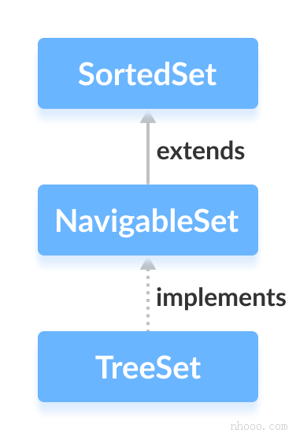

# 数据结构与对象

## 数据结构

### 简单动态字符串（SDS）

```c
struct sdshdr {
    //	记录 buf 数组已使用字节的数量
    //	等于 SDS 所保存字符串的长度
    int len;
    
    //	记录 buf 数组中未使用字节的数量
    int free;
    
    //	字节数组，用于保存字符串
    char buf[];
}
```

1. 常数复杂度获取字符串长度
2. 杜绝缓冲区溢出，修改前会检查空间是否满足所需要求，不满足会扩展空间
3. 空间预分配，减少修改字符串长度时所需的内存重分配次数。
4. 二进制安全（byte数组）
5. 兼容部分 C 字符串函数

### 链表（双端列表）

 ```c
 typedef struct listNode {
     //	前置节点
     struct listNode *prev;
     
     //	后置节点
     struct listNode *next;
     
     //	节点的值
     void *value
 } listNode;
 ```

```c
typedef struct list {
    //	表头节点
    listNode *head;
    
    //	表位节点
    listNode *tail;
    
    //	链表所包含的节点数量
    unsigned long len;
    
    //	节点值复制函数
    void (*free)(void *ptr);
    
    //	节点值对比函数
    int (*match)(void *ptr, void *key);
   
} list;
```


1. 双端
2. 无环，表头结点的 prev 指针和表位节点的 next 指针都指向 NULL，对链表的访问以  NULL 为终点。
3. 带表头和表尾指针，程序获取链表的表头节点和表尾节点的复杂度为O（1）
4. 带链表长度计数器：程序使用 list 结构的 len 属性来对 list 持有的链表节点进行计数，程序获取链表中节点数量的复杂度为 O（1）。
5. 泛型：可以保存不同类型的节点

### 字典（Map）

哈希表：

```c
typedef struct dictht {
    //	哈希表数组
    dictEntry **table;
    
    //	哈希表大小
    unsigned long size;
    
    //	哈希表大小掩码，用于计算索引值
    //	总是等于 size - 1
    unsigned long sizemask;
    
    //	该哈希表已有节点的数量
    unsigned long used;
} dictht;
```

哈希表节点：

```c
typedef struct dictEntry {
    //	键
    void *key;
    
    //	值
    union{
        void *val;
        uint64_tu64;
        int64_ts64;
    } v;
    
    //	指向下个哈希表节点，形成链表
    struct dictEntry *next;
} dictEntry;
```

字典：

```c
typedef struct dict {
    //	类型特定函数
    dictType *type;
    
    //	私有数据
    void *privdata;
    
    //	哈希表，ht[1]用于ht[0]在rehash的时候使用
    dictht ht[2];
    
    //	rehash 索引
    //	当 rehash 不在进行时 值为-1
    int trehashidx;
} dict;
```

type 属性和 privdata 属性是针对不同类型的键值对，为创建多态字典而设置的

- type 属性是一个指向 dictType 结构的指针，每个 dictType 结构保存了一簇用于操作特定类型键值对的函数，Redis会为用途不同的字典设置不同类型特定函数。
- privdata 属性保存了需要传给那些类型特定函数的可选参数。

```c
typedef struct dictType {
    // 计算哈希值的函数
    unsigned int (*hashFunction)(const void *key);
    
    //	复制键的函数
    void *(*keyDup)(void *privdata, const void *key);
    
    //	复制值的函数
    void *(&valDup)(void *privdata, const coid *obj);
    
    //  对比键的函数
    int (*keyCompare)(void *privdata, const void *key1, const void *key2);
    
    //	销毁键的函数
    void (*keyDestructor)(void *privdata, void *key);
    
    //	销毁值的函数
    void (*valDestructor)(void *privdata, void *obj);
} dictType;
```

特点

- **拉练法**解决哈希冲突,头插（因为拉链没有表位节点），java-HashMap 1.8 后是尾插
- 扩容和收缩 都是 2^n
- 双 table 、渐进式 rehash 

**rehash 步骤**

1. 为 ht[1]分配空间，让字典同时持有  ht[0] 和ht[1] 两个哈希表
2. 在字典中维持一个索引计数变量rehashidx，并将它的值设置为 0，表示rehash工作正式开始
3. 在rehash 进行期间，每次对字典执行添加、删除、查找或者更新操作时，程序除了执行指定的操作以外，还会顺带将 ht[0]  哈希表在 rehashidx 索引上的所有键值对 rehash 到ht[1]，当rehash 工作完成之后，程序将 rehashidx 属性的值增一。
4. 随着字典操作的不断执行，最终在某个时间点上，ht[0]  的所有键值对都会被 rehash 至 ht[1] , 这时程序将 rehashidx 属性的值设为 -1，表示 rehash操作已完成。

因为在渐进式 rehash 过程中，字典会同时使用 ht[0] 和 ht[1] 两个哈希表，所以在渐进式 rehash 进行期间，字典的删除、查找、更新等操作会在两个哈希表上进行。例如要在字典里面查找一个键的话，程序会先在  ht[0] 里面进行查找，如果没找到的话，就会继续到 ht[1] 里面进行查找。

另外，在渐进式 rehash 执行期间，新添加到字典的键值对一律会被保存到 ht[1] 里面，而 ht[0]  则不在进行任何添加操作，这一措施保证了 ht[0] 包含的键值对数量会只减不增，并随着 rehash 操作的执行而最终变成空表。

### 跳表（SkipList）

跳表详解：[Skip List--跳表（全网最详细的跳表文章没有之一） - 简书 (jianshu.com)](https://www.jianshu.com/p/9d8296562806)

Redis-zset源码：[redis/t_zset.c at unstable · redis/redis (github.com)](https://github.com/redis/redis/blob/unstable/src/t_zset.c)

跳跃表节点：

```c
typedef struct zskiplistNode {
    //	层
    struct zskiplistLevel {
        //	前进指针
        struct zskiplistNode *forward;
        
        //	跨度
        unsigned int span;
    } level[];
    
    //	后退指针
    struct zskiplistNode *backward;
    
    //	分值
    double score;
    
    //	成员对象
    robj *obj;
}  zskiplistNode;
```

**层**

跳跃表的 level 数组可以包含多个元素，所有包含同层的节点组合构成了跳表该层链表。每次创建一个新的跳跃表节点，程序根据幂次定律（power law， 越大的数出现的概率越小）随机生成一个介于1和32之间的值作为level数组的大小（索引的层数，即该节点要建立几层索引），这个大小就是层的高度。

前进指针：每个层有一个前进指针，指向该层的下一个节点。

跨度：跨度记录了两个节点之间的距离，指向NULL的所有前进指针的跨度都为0

**后退指针**

用于从表位向表头方向访问节点，与前进指针不同，每个节点无论高度，都只有一个后退指针，即最底层有后退指针，每次只能后退一个节点。

跳跃表：

 ```c
 typedef struct zskiplist {
     //  表头节点和表位节点
     struct skiplistNode *header, *tail;
     
     //	表中节点的数量
     unsigned long length;
     
     //	表中层数最大的节点的层数
     int level;
 } zskiplist;
 ```


### 整数集合（IntSet）

整数集合（intset）是集合键的底层实现之一，当一个集合只包含整数值元素，并且这个集合的元素数量不多时，Redis 就会使用整数集合作为集合键的底层实现

```c
typedefg struct intset {
    //	编码方式
    uint32_t encoding;
    
    //	集合包含的元素数量
     uint32_t length;
    
    //	保存元素的数组 有序且不重复
    int8_t contents[];
} intset;
```

**升级**

当新增的元素编码大于当前集合编码时候，例如当前编码为 `INTSET_ENC_INT16` ，新添加一个 `INTSET_ENC_INT32` 类型元素。那么会引发整数集合的升级，把所有元素扩展为`INTSET_ENC_INT32` 类型，对应的 contents 字节数组的长度也会相应增加。

升级的好处：提升灵活性、节约内存。但是不支持降级，一旦升级，编码就会一直保持升级后的状态。

>升级之后新元素的摆放位置
>
>因为引发升级的新元素的长度总是比整数集合现有所有元素的长度都打，所以这个新元素值要么就大于所有现有元素，要么就小于所有现有元素。
>
>怎么理解？
>
>前一句话是因，后一句话是果。
>
>当新插入元素的数据类型大小大于已有元素的数据类型大小时，会触发intset的升级操作。
>
>这个时候 新插入的元素要么大于所有的已有的元素，要么小于所有的已有元素。
>
>假设现在的元素类型是int16，所有元素的取值范围都在区间[-32768,32767]。
>
>如果想触发intset的升级，将元素类型升级为int32，新加入元素的范围区间应该是[-2147483648,-32768)和(32767,2147483647)。
>
>如果新元素在前一个区间，那么它小于-32768，小于所有的int16。
>
>如果新元素在后一个区间，那么它大于32767，大于所有的int16。

### 压缩列表

压缩列表（ziplist）是列表键和哈希键的底层实现之一。当一个列表键只包含少量列表项，并且每个列表项要么就是小整数值，要么就是长度比较短的字符串，那么 Redis 就会使用压缩列表来做列表键的底层实现。

压缩列表节点的构成：

```
previous_entry_length | encoding | content
```

- **previous_entry_length**：以字节为单位，记录了压缩列表中前一个节点的长度。可以通过指针计算，根据当前节点的起始地址来计算出前一个节点的起始地址。可能为1或者5字节（根据前一个节点的大小），如果前一个节点的长度小于 254 字节，需要1字节；如果前一个节点的长度大于 254 字节，那么需要 5字节。
- **encoding**：节点的 encoding 属性记录了节点的 content 属性所保存数据的类型以及长度
- **content**：节点的 content 属性负责保存节点的值，节点值可以是一个字节数组或者整数，值的类型和长度由节点的 encoding 属性决定

连锁更新

考虑这样一个情况：在一个压缩列表中，有多个连续的、长度介于 250 字节到 253 字节之间的节点。因为 `previous_entry_length` 字段只需1字节，那么如果新增一个长度大于254的节点放在列表头，就需要更新之前第一个节点的 previous_entry_length，并且1字节放不下，需要扩展到 5 字节。

扩展后又出现问题了，因为第二个节点的 previous_entry_length 也放不下第一个节点的长度了，所有就引发后面的一系列连续节点都需要重新分配内存。

最坏的情况下需要对压缩列表执行 O(N) 次内存重分配操作。

尽管连锁个更新的复杂度较高，但它真正造成性能问题的几率是很低的：

- 首先压缩列表里要恰好有多个连续的、长度介于 250 字节至 253 字节之间的节点，连锁更新才有可能被引发，实际情况中并不多见
- 其次，即使出现连锁更新，但只要被更新的节点数量不多，就不会对性能造成任何影响。

## 对象

对象类型与编码

类型：数据库键对应的对象类型

编码：对象具体的底层实现

### 字符串对象

编码：int、raw或者 embstr

embstr编码是专门用于保存短字符串的一种优化编码方式，这种编码和 raw 编码一样，都是用redisObject 和sdshdr 结构来表示字符串对象，但 raw 编码会调用两次分配函数来分别创建 redisObject 结构和 sdshdr 结构，而 embstr 编码通过一次内存分配函数分配一块连续空间，一次包含 redisObject 和 sdshdr两个结构。

### 列表对象

编码：ziplist 或者 linkedlist

### 哈希对象

编码：ziplist 或者 hashtable

### 集合对象

编码：intset 或者 hashtable

### 有序集合对象

编码：ziplist 或者 skiplist

## 实现

对象和数据结构部分的实现在 java-redis-core模块 `org.isheihei.redis.core.obj` 和 `org.isheihei.redis.core.struct`包下。

由于 java 中的string类型保存的是char数组，且不支持修改。所以新增了一个 BytesWapper 字节包装类以字节数组的形式保存字符串。

 ```java
 public class BytesWrapper implements Comparable<BytesWrapper> {
 
     static final Charset CHARSET = StandardCharsets.UTF_8;
 
     private final byte[] content;
 
     public BytesWrapper() {
         content = new byte[0];
     }
 
     public BytesWrapper(byte[] content) {
         this.content = content;
     }
 
     public byte[] getByteArray() {
         return content;
     }
 
     public int length() {
         return content == null ? 0 : content.length;
     }
 
     @Override
     public boolean equals(Object o) {
         if (this == o) {
             return true;
         }
         if (o == null || getClass() != o.getClass()) {
             return false;
         }
         BytesWrapper that = (BytesWrapper) o;
         return Arrays.equals(content, that.content);
     }
 
     public String toUtf8String() {
         return new String(content, CHARSET);
     }
 
     @Override
     public int hashCode() {
         return Arrays.hashCode(content);
     }
 
 
     @Override
     public int compareTo(BytesWrapper o) {
         int len1 = content.length;
         int len2 = o.getByteArray().length;
         int lim = Math.min(len1, len2);
         byte v1[] = content;
         byte v2[] = o.getByteArray();
 
         int k = 0;
         while (k < lim) {
             byte c1 = v1[k];
             byte c2 = v2[k];
             if (c1 != c2) {
                 return c1 - c2;
             }
             k++;
         }
         return len1 - len2;
     }
 }
 ```

为了降低系统实现的复杂性，对于五种对象，分别对应了五种数据结构类型，并尽可能复用 Java 已有的数据类和工具。

五种数据对象分别对应

```java
//	字符串对象
RedisStringObject{
	RedisString.value = BytesWrapper
}

//	列表对象
RedisListObject{
	RedisDoubleLinkedListextends LinkedList<BytesWrapper>
}

//	哈希对象
RedisMapObject{
	RedisMap extends HashMap<BytesWrapper, BytesWrapper>
}


//	集合对象
RedisSetObject{
    RedisSet extends HashSet<BytesWrapper>
}

//	有序集合对象
RedisZSetObject{
    RedisZSet extends TreeSet<ZNode>
}

//	ZNode 为有序集合节点：
public class ZNode implements Comparable<ZNode> {
    private BytesWrapper member;
    private double         score;

    public ZNode(double score, BytesWrapper member)
    {
        this.member = member;
        this.score = score;
    }

    public BytesWrapper getMember()
    {
        return member;
    }

    public double getScore()
    {
        return score;
    }

    @Override
    public boolean equals(Object o)
    {
        if (this == o)
        {
            return true;
        }
        if (o == null || getClass() != o.getClass())
        {
            return false;
        }
        ZNode zNode = (ZNode) o;
        return member.equals(zNode.member);
    }

    @Override
    public int hashCode()
    {
        return member.hashCode();
    }

    @Override
    public int compareTo(ZNode o) {
        int scoreComp = Double.compare(score, o.score);
        int memberComp = member.compareTo(o.member);
        if (memberComp == 0) {
            // member 相等 则相等
            return 0;
        } else if (scoreComp == 0) {
            // member不相等且 score相等 按照member排序
            return memberComp;
        } else {
            // member 和 score都不相等 按照score排序
            return scoreComp;
        }
    }
}
```

其中要单独说一下 TreeSet



TreeSet 内部封装了一个 TreeMap 成员对象，底层是红黑树实现了有序，并且不允许重复。T

reeSet中的元素必须实现Comparable接口并重写compareTo()方法，TreeSet判断元素是否重复 、以及确定元素的顺序 靠的都是这个方法； 

所以 ZNode 的 compare 方法非常关键，因为 ZNode有两个属性，一个 member， 一个 score。按照我们的需求，我们允许 score 重复，但是不允许 member 重复；且排序是优先按照 score 排序，score 相等的情况下再按照 member 字典排序。

经过一番尝试与不断的思考，给出以下排序代码

```java
    @Override
    public int compareTo(ZNode o) {
        int scoreComp = Double.compare(score, o.score);
        int memberComp = member.compareTo(o.member);
        if (memberComp == 0) {
            // member 相等 则相等
            return 0;
        } else if (scoreComp == 0) {
            // member不相等且 score相等 按照member排序
            return memberComp;
        } else {
            // member 和 score都不相等 按照score排序
            return scoreComp;
        }
    }
```

但是这种方案还是有问题，目前已知的有两点：

1. add方法不能覆盖旧的节点，如果想对 member 相同但是分数不同的节点进行修改，无法直接add，因为`compareTo`()的结果虽然是相等，但是add通过比较判断相等则没有添加覆盖的操作，目前的方案是先删除旧节点，再添加。
2. 在使用 TreeSet 方法 `subSet()` 截取区间时，无法保留右边界元素会失败。例如：`this.subSet(new ZNode(min, new BytesWrapper()),true,new ZNode(max, new BytesWrapper()),true);` 无法取到保留右边界元素。原因是：在创建ZNode的时候使用了空字符数组创建，当`compareTo()`比较的时候，如果 score 相等，则会比较 member，因为空串永远是最小的，所以我们想要取到的 score 值相同的 ZNode 永远比我们传入的这个节点大。