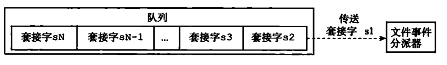

## Redis事件

### 事件模型


Redis 基于 Reactor 模式开发了自己的网络事件处理器。

- I/O多路复用程序同时监听多个套接字，并向文件事件分派器传送那些产生了事件的套接字。

- 文件事件分派器则接收I/O多路复用程序传来的套接字，并根据套接字产生的事件的类型，调用相应的事件处理器
- 尽管多个文件事件可能会并发地出现，但I/O多路复用程序会将所有产生的套接字都放到一个队列里面，然后通过这个队列向文件事件分派器传送套接字（一个一个顺序进行）。



IO模型详解：[IO模型分析与对比](http://isheihei.cn/posts/计算机基础/io模型分析与对比/)

### 文件事件

Redis事件分为文件事件和时间事件，文件事件就是服务器对套接字操作的抽象，服务器与客户端的通信会产生相应的文件事件，通俗点来说，就是客户端通过命令等方式发送给服务端的请求事件就是文件事件。

文件事件是以单线程方式运行。

文件事件处理器主要有：命令请求处理器、命令回复处理器、连接应答处理器

### 时间事件

时间时间主要是周期性事件。

serverCron 函数就是一个时间事件实例，它主要做的工作包括：

- 更新服务器各种统计信息，比如事件、内存占用、数据库占用等
- 清理数据库中的过期键值对
- 关闭和清理连接失效的客户端
- 尝试进行AOF或RDB持久化操作
- 如果服务器是主服务器，那么对从服务器进行定期同步
- 如果出于集群模式，对集群进行定期同步和连接测试

事件的调度和执行规则

1. 因为文件事件是随机出现的，如果等待并处理完一次文件事件后，仍未有任何时间事件到达，那么服务器将再次等待并处理文件事件。随着文件事件的不断执行，时间会逐渐向时间事件所设置的到达时间逼近，并最终来到到达时间，这时服务器就可以开始处理到达的时间事件了。
2. 文件事件和时间事件的处理都是同步、有序、原子地执行，服务器不会中途中断事件处理，也不会对事件进行抢占。
3. 因为时间事件在文件事件之后执行，并且事件之间不会抢占，所以时间事件的实际处理时间，通常会比时间事件设定的到达事件稍晚一些。

## Redis协议详细规范

此章节为转载，原文链接：[Redis协议详细规范](https://www.redis.com.cn/topics/protocol.html)

Redis客户端和服务器端通信使用名为 **RESP** (REdis Serialization Protocol) 的协议。虽然这个协议是专门为Redis设计的，它也可以用在其它 client-server 通信模式的软件上。

RESP 是下面条件的折中：

- 实现起来简单。
- 解析速度快。
- 有可读性。

RESP 能序列化不同的数据类型，例如整型(integers)、字符串(strings)、数组(arrays)。额外还有特殊的错误类型。请求从客户端以字符串数组的形式发送到redis服务器，这些字符串表示要执行的命令的参数。Redis用特定于命令的数据类型回复。

RESP 是二进制安全的，并且不需要处理从一个进程发到另外一个进程的批量数据，因为它使用前缀长度来传输批量数据。

 注意：这里概述的协议仅用于客户机-服务器通信。Redis集群使用不同的二进制协议在节点之间交换消息。

### 网络层

连到Redis服务器的客户端建立了一个到6379端口的TCP连接。

虽然RESP在技术上不特定于TCP，但是在Redis的上下文中，该协议仅用于TCP连接（或类似的面向流的连接，如unix套接字）。

### 请求-响应模型

Redis接受由不同参数组成的命令。一旦收到命令，就会对其进行处理，并将应答发送回客户端。

这是最简单的模型，但是有两个例外：

- Redis 支持管道pipelining。所以，客户端可以一次发送多个命令，然后再等待应答。
- 当一个Redis客户端订阅一个频道，那么协议会改变语义并变成*push*protocol, 也就是说，客户客户端不再需要发送命令，因为服务器端会一收到新消息，就会自动发送给客户端。

除了上面两个例外情况，Redis协议是一个简单的请求-响应协议。

### RESP 协议解释

RESP 协议在Redis1.2被引入，直到Redis2.0才成为和Redis服务器通信的标准。这个协议需要在你的Redis客户端实现。

RESP 是一个支持多种数据类型的序列化协议：简单字符串（Simple Strings）,错误（ Errors）,整型（ Integers）, 大容量字符串（Bulk Strings）和数组（Arrays）。

RESP在Redis中作为一个请求-响应协议以如下方式使用：

- 客户端以大容量字符串RESP数组的方式发送命令给服务器端。
- 服务器端根据命令的具体实现返回某一种RESP数据类型。

在 RESP 中，数据的类型依赖于首字节：

- **单行字符串（Simple Strings）：** 响应的首字节是 "+"
- **错误（Errors）： 响应的首字节是** "-"
- **整型（Integers）： 响应的首字节是** ":"
- **多行字符串（Bulk Strings）： 响应的首字节是**"\$"
- **数组（Arrays）：** 响应的首字节是 "`*`"

另外，RESP可以使用大容量字符串或者数组类型的特殊变量表示空值，下面会具体解释。RESP协议的不同部分总是以 "\r\n" (CRLF) 结束。

### RESP 单行字符串

单行字符串编码方法: 加号后面跟着一个不包含回车或换行字符的字符串 (不允许出现换行)，以CRLF("\r\n")结尾。

单行字符串通常被用来传输非二进制安全字符串并且消耗极小。例如，许多redis命令在成功时回复"OK"，即简单字符串用以下5个字节编码：

```
"+OK\r\n"
```

为了发送二进制安全的字符串，需要使用RESP的多行字符串（Bulk Strings）替代。

当Redis返回单行字符串（Simple String）时，客户端lib应该返回去掉首字符加号和结尾CRLF字符的字符串给调用者。

### RESP 错误

RESP 有特殊类型来处理错误。errors类型除了首字符是减号 '-'不是加号以外，其它跟简单字符串一样。RESP中简单字符和错误的真正区别是：错误被客户端当作异常处理，组成错误类型的字符串是错误消息自身。

基本格式如下:

```
"-Error message\r\n"
```

错误应答只在发生异常时发送，例如，要执行命令的参数数据类型不匹配或者命令不存在等。当收到错误返回时，客户端lib应该抛出一个异常。

错误返回例子:

```
-ERR unknown command 'foobar'
-WRONGTYPE Operation against a key holding the wrong kind of value
```

从"-"后面第一个单词起，直到第一个空格或者换行，表示返回的错误类型。这是Redis的一种约定，并不是RESP协议的要求。

`ERR` 是一个通用错误, 而 `WRONGTYPE` 是表示更具体的错误，意味着客户端在错误的数据类型上执行操作。这被叫做错误前缀（**Error Prefix），** 使客户端不用依赖具体错误消息就知道返回的错误类型，错误消息可能会随着时间而变化。

客户端实现可能会对不同异常返回不同类型的错误，或者可能提供一种通用的方式来捕获错误，通过以字符串的形式直接返回错误名给调用者。

尽管如此，这种特性不能认为很重要，因为它很少被使用。一小部分客户端的实现可能会返回通用错误条件，例如`false。`

### RESP 整数

整数类型是由以冒号开头，CRLF结尾，中间是字符串形式表示的数字。 例如 ":0\r\n", 或 ":1000\r\n" 都是整数回复。

很多Redis命令返回RESP整数，像 [INCR](http://www.redis.com.cn/commands/incr), [LLEN](http://www.redis.com.cn/commands/llen) 和 [LASTSAVE](http://www.redis.com.cn/commands/lastsave).

返回的整数并没有特别的意义， [INCR](http://www.redis.com.cn/commands/incr) 返回的是一个递增的数字， [LASTSAVE](http://www.redis.com.cn/commands/lastsave) 返回的是Unix时间戳等。返回的整数有效值需要在有符号64位整数范围内。

整数返回也被广泛的用来返回 true 或 false。比如 [EXISTS](http://www.redis.com.cn/commands/exists) 或 [SISMEMBER](http://www.redis.com.cn/commands/sismember) 命令返回1表示true，返回0表示false。

其它命令像 [SADD](http://www.redis.com.cn/commands/sadd), [SREM](http://www.redis.com.cn/commands/srem) 和 [SETNX](http://www.redis.com.cn/commands/setnx) 如果操作被执行则返回1，否则返回0。

返回整数回复的命令： [SETNX](http://www.redis.com.cn/commands/setnx), [DEL](http://www.redis.com.cn/commands/del), [EXISTS](http://www.redis.com.cn/commands/exists), [INCR](http://www.redis.com.cn/commands/incr), [INCRBY](http://www.redis.com.cn/commands/incrby), [DECR](http://www.redis.com.cn/commands/decr), [DECRBY](http://www.redis.com.cn/commands/decrby), [DBSIZE](http://www.redis.com.cn/commands/dbsize), [LASTSAVE](http://www.redis.com.cn/commands/lastsave), [RENAMENX](http://www.redis.com.cn/commands/renamenx), [MOVE](http://www.redis.com.cn/commands/move), [LLEN](http://www.redis.com.cn/commands/llen), [SADD](http://www.redis.com.cn/commands/sadd), [SREM](http://www.redis.com.cn/commands/srem), [SISMEMBER](http://www.redis.com.cn/commands/sismember), [SCARD](http://www.redis.com.cn/commands/scard).

### RESP 多行字符串

多行字符串被用来表示最大512MB长的二进制安全字符串。

多行字符串编码方式：

- 美元符 "\$" 后面跟着组成字符串的字节数(前缀长度)，并以 CRLF 结尾。
- 实际的字符串数据。
- 结尾是 CRLF。

所以，字符串 "foobar" 编码如下:

```
"$6\r\nfoobar\r\n"
```

空字符串编码格式：

```
"$0\r\n\r\n"
```

RESP 多行字符串（Bulk Strings） 也可以使用一个特殊的用来表示空值的格式表示不存在的值。在这种格式里长度值为-1，数据部分不存在，所以空（Null）用如下方式表示：

```
"$-1\r\n"
```

叫做**空的多行字符串Null Bulk String。**

客户端API库不应该返回空串，当服务器端响应一个空的多行字符串时，API库可以返回一个空对象给调用者。例如，Ruby库应该返回 'nil' ，而C库应该返回NULL。 

### RESP 数组

客户端使用 RESP 数组发送命令到 Redis 服务端。同样地，某些命令的应答使用RESP数组返回元素的集合给Redis客户端。 [LRANGE](http://www.redis.com.cn/commands/lrange) 命令返回元素列表就是一个例子。

RESP 数组使用如下格式发送：

- 以星号`* 为首字符，接着是表示数组中元素个数的十进制数`，最后以 CRLF 结尾。
- 外加数组中每个 RESP 类型的元素。

空数组表示：

```
"*0\r\n"
```

有两个 RESP 多行字符串"foo" 和"bar"元素的 RESP 数组 ：

```
"*2\r\n$3\r\nfoo\r\n$3\r\nbar\r\n"
```

在前缀 `*<count>CRLF` 的后面，组成数组的其它数据类型一个接在另一个后面。 例如包含三个整数的数组编码方式：

```
"*3\r\n:1\r\n:2\r\n:3\r\n"
```

数组可以包含混合类型，不一定必须是同一种类型。例如，4个整型和1个多行字符串编码方式：

```
*5\r\n
:1\r\n
:2\r\n
:3\r\n
:4\r\n
$6\r\n
foobar\r\n
```

(为了方便阅读，应答分成多行来展示)

第一个行表示 `*5\r\n` 说明后面有5个应答。这些应答组成一个大的应答一起发送。

空数组的概念也是存在的，另一个表示空值的方式(通常使用多行空字符串，历史遗留导致有这两种格式)。

例如，当 [BLPOP](http://www.redis.com.cn/commands/blpop) 命令超时，它会返回一个空数组，数组的计数器是-1 :

```
"*-1\r\n"
```

当 Redis 返回一个空数组的时候，Redis客户端库API应该返回一个空对象而不是返回一个空数组。 这对区分空列表和其它不同情况（像 [BLPOP](http://www.redis.com.cn/commands/blpop) 命令超时情况）是必要的。

数组的数组也是可行的。例如，一个含有两个数组元素的数组编码方式：

```
*2\r\n
*3\r\n
:1\r\n
:2\r\n
:3\r\n
*2\r\n
+Foo\r\n
-Bar\r\n
```

(为了方便阅读，分成多行来展示).

上面的 RESP 数据类型包含两个数组，一个数组包含三个整数1, 2, 3 ，另一个是简单字符串和一个错误类型。

### 数组中的空元素

数组中可以有为空的元素。主要使用在Redis应答中，为了表示这个元素丢失并且不是一个空的字符串。当SORT命令使用GET 模式选项，并且特定的key丢失的时会出现这种应答。 含有有空元素的应答数组例子：

```
*3\r\n
$3\r\n
foo\r\n
$-1\r\n
$3\r\n
bar\r\n
```

第二个元素是空，客户端库应该返回像下面这样的数据：

```
["foo",nil,"bar"]
```

这不是前面提到的异常情况，这只是说明协议的一个例子。

### 发送命令到Redis服务器

至此，我们已经很熟悉RESP序列化格式，写一个Redis客户端库的实现会变得很容易。我们可以进一步说明客户端和服务端如何交互工作：

- 客户端发送包含只有多行字符串的数组给Redis服务器。
- Redis 服务器给客户端发送任意有效的 RESP 数据类型作为应答。

下面是一个典型的交互过程例子：

客户端发送命令 **LLEN mylist** 来获取存储在 *mylist* 键中列表的长读，然后服务器端返回整数应答(C: 代表客户端, S: 代表服务器端).

```shell
C: *2\r\n
C: $4\r\n
C: LLEN\r\n
C: $6\r\n
C: mylist\r\n

S: :48293\r\n
```

为了方便理解我们用换行把协议分成不同部分，实际上客户端发送的是一个整体没有换行：`*2\r\n$4\r\nLLEN\r\n$6\r\nmylist\r\n` as a whole.

### Redis 协议的高性能解析器

虽然redis协议是非常容易被人阅读和实现的，但是它可以以类似于二进制协议的性能来实现。

RESP 使用带前缀的长度来传输批量数据，因此不需要像使用json那样扫描有效负载以查找特殊字符，也不需要引用需要发送到服务器的有效负载。

批量和多批量长度可以使用代码进行处理，代码对每个字符执行单个操作，同时扫描CR字符，如以下C代码：

RESP 使用带前缀的长度来传输多行数据，因此不需要像使用json那样扫描有效负载以查找特殊字符，也不需要引用需要发送到服务器的有效负载。

多行和多个多行长度可以使用代码进行处理，代码对每个字符执行单个操作，同时扫描CR字符，如以下C代码：

```c
#include <stdio.h>

int main(void) {
    unsigned char *p = "$123\r\n";
    int len = 0;

    p++;
    while(*p != '\r') {
        len = (len*10)+(*p - '0');
        p++;
    }

    /* Now p points at '\r', and the len is in bulk_len. */
    printf("%d\n", len);
    return 0;
}
```

在识别出第一个CR之后，可以跳过它和下面的LF，而不需要任何处理。然后，可以使用不以任何方式检查有效负载的单个读取操作读取大容量数据。最后，剩余的CR和LF字符将被丢弃，而不进行任何处理。

Redis协议有着与二进制协议可比的性能，更重要的是易于在大多数高级语言中实现，从而减少了客户端软件中的错误数量。

## 实现

### 事件模型

对于Redis事件模型，java-redis 基于netty实现nio，并使用单线程事件处理器执行文件事件操作。如下图所示

```java
public class RedisNetServer implements RedisServer {

    private final ServerBootstrap serverBootstrap = new ServerBootstrap();

    // 处理 redis 核心操作的线程，是单线程的
    private final EventExecutorGroup redisSingleEventExecutor = new NioEventLoopGroup(1);

    // 处理连接和io操作的线程
    private LocalChannelOption channelOption;
    
    @Override
    public void start() {
        start0();
    }

    private void start0() {
        serverBootstrap.group(channelOption.boss(), channelOption.selectors())
                .channel(channelOption.getChannelClass())
                .handler(new LoggingHandler(LogLevel.INFO))
                .option(ChannelOption.SO_BACKLOG, 1024)
                .option(ChannelOption.SO_REUSEADDR, true)
                .localAddress(new InetSocketAddress(ip, port))
                .childHandler(new ChannelInitializer<SocketChannel>() {
                    @Override
                    protected void initChannel(SocketChannel socketChannel) {
                        // 初始化客户端
                        int id = clientId.incrementAndGet();
                        RedisClient client = new RedisNormalClient(socketChannel.localAddress().toString(), id, dbs);

                        //  初始化 channel
                        ChannelPipeline channelPipeline = socketChannel.pipeline();
                        channelPipeline.addLast(
                                new ResponseEncoder(),
                                new CommandDecoder(aof)
                        );
                        channelPipeline.addLast(redisSingleEventExecutor, new CommandHandler(client, rdb));
                    }
                });
        try {
            ChannelFuture sync = serverBootstrap.bind().sync();
            LOGGER.info(sync.channel().localAddress().toString());
        } catch (InterruptedException e) {
            LOGGER.warn("Interrupted!", e);
            throw new RuntimeException(e);
        }
    }

}
```

nio多路复用模型，实现了单路模型，以及基于Epoll，Kqueue的多路模型。netty默认的nio模型底层是select。

 ```java
/**
 * @ClassName: SingleSelectChannelOption
 * @Description: 单路模型
 * @Date: 2022/6/8 20:56
 * @Author: isheihei
 */
public class SingleSelectChannelOption implements LocalChannelOption {
    private final NioEventLoopGroup single;

    public SingleSelectChannelOption(NioEventLoopGroup single) {
        this.single = single;
    }
    public SingleSelectChannelOption()
    {
        this.single = new NioEventLoopGroup(1, new ThreadFactory() {
            private AtomicInteger index = new AtomicInteger(0);

            @Override
            public Thread newThread(Runnable r) {
                return new Thread(r, "Server_boss_" + index.getAndIncrement());
            }
        });

    }
    @Override
    public EventLoopGroup boss() {
        return  this.single;
    }

    @Override
    public EventLoopGroup selectors() {
        return  this.single;
    }

    @Override
    public Class getChannelClass() {
        return NioServerSocketChannel.class;
    }
}
 ```

### 协议

共五种消息类型：SimplString、BulkString、RespInt、RespArray、Errors

协议编解码：

```java
/**
 * @ClassName: Resp
 * @Description: Redis Serialization Protocol协议
 * @Date: 2022/6/1 13:15
 * @Author: isheihei
 */
public interface Resp {

    org.apache.log4j.Logger LOGGER = org.apache.log4j.Logger.getLogger(Resp.class);

    Charset CHARSET = StandardCharsets.UTF_8;

    /**
     * @Description: 回写
     * @Param: resp 
     * @Param: buffer 
     * @Return: void
     * @Author: isheihei
     */
    static void write(Resp resp, ByteBuf buffer) {
        if (resp instanceof SimpleString) {
            buffer.writeByte(RespType.STATUS.getCode());
            String content = ((SimpleString) resp).getContent();
            buffer.writeBytes(content.getBytes(CHARSET));
            writeEof(buffer);
        } else if (resp instanceof Errors) {
            buffer.writeByte(RespType.ERROR.getCode());
            String content = ((Errors) resp).getContent();
            buffer.writeBytes(content.getBytes(CHARSET));
            writeEof(buffer);
        } else if (resp instanceof RespInt) {
            buffer.writeByte(RespType.INTEGER.getCode());
            String content = String.valueOf(((RespInt) resp).getValue());
            buffer.writeBytes(content.getBytes(CHARSET));
            writeEof(buffer);
        } else if (resp instanceof BulkString) {
            buffer.writeByte(RespType.BULK.getCode());
            BytesWrapper content = ((BulkString) resp).getContent();
            if (content == null) {
                // null: "$-1\r\n"
                buffer.writeByte(RespType.ERROR.getCode());
                buffer.writeByte(RespType.ONE.getCode());
                writeEof(buffer);
            } else if (content.getByteArray().length == 0) {
                // 空串: "$0\r\n\r\n"
                buffer.writeByte(RespType.ZERO.getCode());
                writeEof(buffer);
                writeEof(buffer);
            } else {
                // 正常编码："foobar" 的编码为 "$6\r\nfoobar\r\n"，其中 6 是字节数
                String length = String.valueOf(content.getByteArray().length);
                buffer.writeBytes(length.getBytes(CHARSET));
                writeEof(buffer);
                buffer.writeBytes(content.getByteArray());
                writeEof(buffer);
            }
        } else if (resp instanceof RespArray) {
            buffer.writeByte(RespType.MULTYBULK.getCode());
            Resp[] array = ((RespArray) resp).getArray();
            String length = String.valueOf(array.length);
            buffer.writeBytes(length.getBytes(CHARSET));
            writeEof(buffer);
            for (Resp each : array) {
                write(each, buffer);
            }
        } else {
            throw new IllegalArgumentException();
        }
    }

    /**
     * @Description: 解码为协议对应具体格式
     * @Param: buffer
     * @Return: Resp
     * @Author: isheihei
     */
    static Resp decode(ByteBuf buffer) {
        if (buffer.readableBytes() <= 0) {
            throw new IllegalStateException("没有读取到完整的命令");
        }

        byte b =buffer.readByte();
        if (b == RespType.STATUS.getCode()) {
            return new SimpleString(getString(buffer));
        } else if (b == RespType.ERROR.getCode()) {
            return new Errors(getString(buffer));
        } else if (b == RespType.INTEGER.getCode()) {
            int value = getNumber(buffer);
            return new RespInt(value);
        } else if (b == RespType.BULK.getCode()) {
            int length = getNumber(buffer);
            if (buffer.readableBytes() < length + 2) {
                throw new IllegalStateException("没有读取到完整的命令");
            }
            byte[] content;
            if (length == -1) {
                content = null;
            } else {
                content = new byte[length];
                buffer.readBytes(content);
            }
            if (buffer.readByte() != RespType.R.getCode() || buffer.readByte() != RespType.N.getCode()) {
                throw new IllegalStateException("没有读取到完整的命令");
            }
            return new BulkString(new BytesWrapper(content));
        } else if (b == RespType.MULTYBULK.getCode()) {
            int numOfElement = getNumber(buffer);
            Resp[] array = new Resp[numOfElement];
            for (int i = 0; i < numOfElement; i++) {
                array[i] = decode(buffer);
            }
            return new RespArray(array);
        } else {
            throw new IllegalStateException("无法解析命令");
        }
    }


    /**
     * @Description: 读取整数类型
     * @Param: buffer
     * @Return: int
     * @Author: isheihei
     */
    static int getNumber(ByteBuf buffer) {
        byte b;
        b = buffer.readByte();
        boolean positive = true;
        int value = 0;
        // 错误（Errors）： 响应的首字节是 "-"
        if (b == RespType.ERROR.getCode()) {
            positive = false;
        } else {
            value = b - RespType.ZERO.getCode();
        }
        while (buffer.readableBytes() > 0 && (b = buffer.readByte()) != RespType.R.getCode()) {
            value = value * 10 + (b - RespType.ZERO.getCode());
        }
        if (buffer.readableBytes() == 0 || buffer.readByte() != RespType.N.getCode()) {
            throw new IllegalStateException("没有读取到完整的命令");
        }
        if (!positive) {
            value = -value;
        }
        return value;
    }

    /**
     * @Description: 读取一条字符串
     * @Param: buffer
     * @Return: String
     * @Author: isheihei
     */
    static String getString(ByteBuf buffer) {
        byte b;
        ByteBuf byteBuf = PooledByteBufAllocator.DEFAULT.directBuffer();
        // 以终止符 /R 为结束标志
        while (buffer.readableBytes() > 0 && (b = buffer.readByte()) != RespType.R.getCode()) {
            byteBuf.writeByte(b);
        }
        // /R 后面必须紧接 /N
        if (buffer.readableBytes() == 0 || buffer.readableBytes() != RespType.N.getCode()) {
            throw new IllegalStateException("没有读取到完整的命令");
        }
        return byteBuf.toString(CHARSET);
    }

    /**
     * @Description: 写协议终止符："\r\n" (CRLF)
     * @Param: buffer
     * @Return: void
     * @Author: isheihei
     */
    static void writeEof(ByteBuf buffer) {
        buffer.writeByte(RespType.R.getCode());
        buffer.writeByte(RespType.N.getCode());
    }
```

