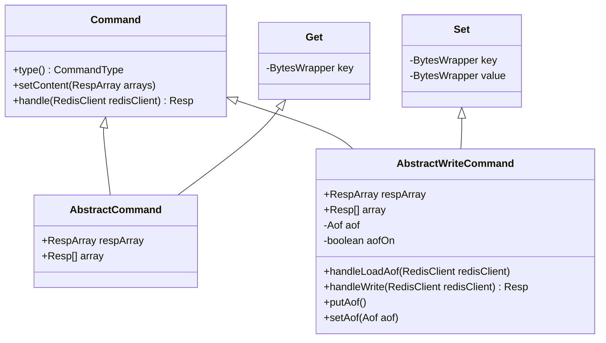

## 命令

### 继承结构

对于 redis 的众多命令，在设计实现的时候，尽可能的去抽象代码。除了抽象出命令的顶层 interface 之外，对于查询命令和修改命令，又划分出两个抽象类。最终的继承结构如下：



`Command`接口三个主要方法

- `type()`：返回命令类型
- `setContent(RespArray arrays)`：设置命令参数
- `handle(RedisClient redisClient)`：执行命令逻辑

`AbstractCommand` ：抽象了查询命令并实现了`setContent(RespArray arrays)`方法

`AbstractWriteCommand`：

抽象了更新修改命令并实现了`setContent(RespArray arrays)`、`handle(RedisClient redisClient)`方法。并使用了模板方法模式用于写入AOF。提供了一个钩子变量 `aofOn`，当该变量为 true 时，`handle` 方法会执行 `aof.putAof` 操作。

```java
    @Override
    public Resp handle(RedisClient redisClient) {
        if (aofOn) {
            putAof();
        }
        return handleWrite(redisClient);
    }

    public abstract Resp handleWrite(RedisClient redisClient);
```

### 实现的命令

**命令手册：**

[Commands | Redis](https://redis.io/commands/)

[redis 命令手册](https://www.redis.com.cn/commands.html)

#### CONNECTION

```java
auth(Auth::new), client(Client::new), 
config(Config::new), echo(Echo::new), 
ping(Ping::new), quit(Quit::new)
```

#### SEVER

```java
select(Select::new), flushall(FlushAll::new),
dbsize(DbSize::new), flushdb(FlushDb::new), 
bgsave(BgSave::new), save(Save::new)
```

#### KEY

```java
expire(Expire::new), del(Del::new), 
exists(Exists::new), keys(Keys::new), 
persist(Persist::new), rename(Rename::new),
ttl(Ttl::new), type(Type::new),
```

#### TRANSACTION

```java
multi(Multi::new), exec(Exec::new), 
unwatch(UnWatch::new), watch(Watch::new), 
discard(Discard::new)
```

#### STRING

```java
get(Get::new), set(Set::new), 
mget(MGet::new), mset(MSet::new), 
append(Append::new), setex(SetEx::new), 
setnx(SetNx::new)
```

#### LIST

```java
lpush(LPush::new), lrange(LRange::new), 
lrem(LRem::new), rpush(RPush::new), 
lpop(LPop::new), rpop(RPop::new), 
lset(LSet::new), lindex(LIndex::new), 
llen(LLen::new),
```

#### HASH

```java
hdel(HDel::new), hexists(HExists::new), 
hget(HGet::new), hgetall(HGetAll::new), 
hkeys(HKeys::new), hset(HSet::new),
hmset(HMSet::new), hvals(HVals::new), 
hmget(HMGet::new),
```

#### SET

```java
sadd(SAdd::new), scard(SCard::new), 
sdiff(SDiff::new), smembers(SMembers::new), 
sismember(SIsMember::new), sdiffstore(SDiffStore::new), 
sinter(SInter::new), sinterstore(SInterStore::new), 
srem(SRem::new), sunion(SUnion::new), 
sunionstore(SUnionStore::new),
```

#### ZSET

```java
zadd(ZAdd::new), zcard(ZCard::new), 
zcount(ZCount::new), zrange(ZRange::new), 
zrangebyscore(ZRangeByScore::new),
zrank(ZRank::new), zrem(ZRem::new), 
zscore(ZScore::new),
```
