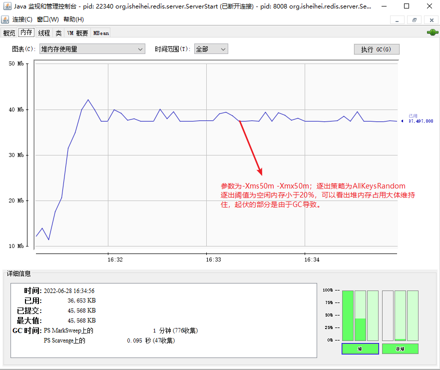

## 过期策略

数据库中有一个过期字典，字典的 key 是被设置过期时间的键，字典的 value 是过期时间（long 类型 以毫秒为单位的 UNXI 时间戳）。

### 删除策略

#### 定时删除

在设置键的过期时间的同时，创建一个定时器，让定时器在键的过期时间来临时，立即执行对键的删除操作。

**优点**：对内存最友好，通过使用定时器，定时删除策略可以保证过期键会尽可能快地被删除，并释放过期键所占用的内存。

**缺点**：对CPU时间最不友好，在过期键比较多的情况下，删除过期键这一行为可能会占用相当一部分CPU时间。在内存不紧张但是CPU时间非常紧张的情况下，拿CPU去做与当前任务无关的过期键上没有意义。

#### 惰性删除

放任过期键不管，但是每次从键空间中获取键时，都检查取得的键是否过期，如果过期的话，就删除该键；如果没有过期，就返回该键。

优点：对CPU时间最友好，不会在删除其他无关的过期键上花费任何CPU时间

缺点：对内存最不友好，如果一个键已经过期，而这个键又仍然保留在数据库中，那么只要这个过期键不被删除，它所占用的内存就不会释放。可以把这种情况视为一种内存泄漏。

#### 定期删除

每隔一段时间， 程序就对数据库进行一次检查，删除里面的过期键。至于要删除多少过期键，以及要检查多少个数据库，则由算法决定。

定期策略是前两种策略的一种整合和折中：

- 定期删除策略每隔一段时间执行一次删除过期键操作，并通过限制删除操作执行的时长和频率来减少删除操作对CPU时间的影响。
- 除此之外，通过定期删除过期键，定期删除策略有效地减少了因为过期键而带来的内存浪费

定期删除策略的难点是确定删除操作执行的时长和频率：

- 如果删除操作执行地太过频繁，或者执行的时间太长，定期删除策略就退化成定时删除策略
- 如果删除操作执行得太少，或者执行地太短，定期删除策略又会和惰性删除策略一样，出现浪费内存的情况

### Redis 的过期键删除策略

Redis 使用了惰性删除策略和定期删除策略结合的方式

#### 惰性删除策略的实现

所有读写数据库的命令在执行之前都会先判断输入键是否已经过期

- 如果输入键已经过期，那么将输入键删除
- 如果输入键未过期，那么正常执行

```java
public class RedisDBImpl implements RedisDB {
    //  过期字典
    private final Map<BytesWrapper, Long> expires = new HashMap<>();
    
    //	在获取键的时候先判断是否已经过期，如果过期就删除
    public RedisObject get(BytesWrapper key) {
        RedisObject redisObject = dict.get(key);
        if (redisObject == null) {
            return null;
        } else if (isExpired(key)){
            expires.remove(key);
            dict.remove(key);
            return null;
        } else {
            redisObject.refreshLru();
            redisObject.updateLfu();
            return redisObject;
        }
    }
}
```

#### 定期删除策略的实现

`ServerCron` 是服务器的时间事件之一，主要执行一些周期性操作。定期策略在 `ServerCron` 类中被调用：

```java
    private void databasesCron() {
        expireStrategy.activeExpireCycle();
    }
```

```java
    @Override
    public void activeExpireCycle() {
        start = System.currentTimeMillis();
        int dbSize = dbs.size();
        if (dbSize < dbNumbers) {
            // 如果数据库当前数量比默认的数量少，取当前数量
            dbNumbers = dbSize;
        }

        // 当前遍历到的数据库索引
        currentDb %= dbSize;
        int deleteCount = 0;
        
        // keyNumbers为每次从数据库过期字典中取出的键的数量，默认为20
        for (int i = 0; i < keyNumbers; i++){
            RedisDB redisDB = dbs.get(currentDb);
            int expiresSize = redisDB.expiresSize();
            if (expiresSize == 0) return;
            // 随机取，看是否过期，过期就删除它
            BytesWrapper randomKey = redisDB.getRandomExpires();
            if (redisDB.isExpired(randomKey)) {
                LOGGER.info("过期key: "  + randomKey.toUtf8String() +  "被删除");
                deleteCount++;
                redisDB.delete(randomKey);
            }
            //	执行事件到达上限则结束 timeLimit = TimeUnit.MICROSECONDS.toMillis(1000)
            if (System.currentTimeMillis() - start > timeLimit) {
                return;
            }
            //  如果抽样的 20 个键过期的超过 1/4 则重复该过程
            if (deleteCount > keyNumbers / 4) {
                deleteCount = 0;
                i = 0;
            }
        }
    }
```

### 扩展：从库的过期策略

从库不会进行过期扫描，从库对过期的处理是被动的。主库在 key 到期时，会在 AOF 文件里增加一条 `del` 指令，同步到所有的从库，从库通过执行这条 `del` 指令来删除过期的 key。

因为指令同步是异步进行的，所以主库过期的 key 的 `del` 指令没有及时同步到从库的话，会出现主从数据的不一致，主库没有的数据在从库里还存在。

## 逐出策略

### 数据淘汰机制

Redis 内存数据集大小上升到一定大小的时候，就会施行数据淘汰策略。Redis 提供 6 种数据淘汰策略：

1. volatile-lru：从已设置过期时间的数据集（server.db[i].expires）中挑选最近最少使用 的数据淘汰
2. volatile-ttl：从已设置过期时间的数据集（server.db[i].expires）中挑选将要过期的数 据淘汰，ttl （Time To Live）越小越优先被淘汰。
3. volatile-random：从已设置过期时间的数据集（server.db[i].expires）中任意选择数据 淘汰
4. allkeys-lru：从数据集（server.db[i].dict）中挑选最近最少使用的数据淘汰
5. allkeys-random：从数据集（server.db[i].dict）中任意选择数据淘汰
6. no-enviction（驱逐）：禁止驱逐数据

redis5.0新增：

1. volatile-lfu：从已设置过期时间的数据集挑选使用频率最低的数据淘汰。
2. allkeys-lfu：从数据集中挑选使用频率最低的数据淘汰。

volatile-xxx 策略只会针对带过期时间的 key 进行淘汰，allkeys-xxx 策略会对所有的 key 进行淘汰。如果你只是拿 Redis 做缓存，那应该使用 allkeys-xxx，客户端写缓存时不必携带过期时间。如果你还想同时使用 Redis 的持久化功能，那就使用 volatile-xxx 策略，这样可以保留没有设置过期时间的 key，它们是永久的 key 不会被 LRU 算法淘汰。

### 实现

#### 何时淘汰？

Redis实例支持通过修改配置参数（maxmemory-policy），修改数据逐出策略。在达到内存上限（maxmemory）时，Redis根据逐出策略进行数据逐出。

而 Java-Redis 是基于 Java 语言实现，那么内存大小就受限于 JVM内存大小。

- JVM初始分配的内存由-Xms指定，默认是物理内存的1/64;

- JVM最大分配的内存由-Xmx指定，默认是物理内存的1/4。
- 默认空余堆内存**小于40%**时，JVM就会增大堆直到-Xmx的最大限制；

- 空余堆内存**大于70%**时，JVM会减少堆直到-Xms的最小限制。因此服务器一般设置-Xms、-Xmx相等以避免在每次GC后调整堆的大小。

而且 Java 提供的 `Runtime.getRuntime().totalMemory()` 、 `Runtime.getRuntime().maxMemory()` 、`Runtime.getRuntime().freeMemory()`方法能获取当前 JVM 已分配内存 、 JVM 最大可扩展内存以及 JVM 当前已分配内存中的空闲内存。

为了适配 JVM 内存，给出以下内存策略：

建议**初始内存和最大内存参数相等**，这样可以避免运行过程中的内存重分配过程，也更容易精确计算当前内存的占用情况。

但是：由于 JVM 的内存的 GC 时间是不固定的，有些已经被淘汰的键不能被虚拟机及时回收，可能会造成获取的内存占用信息实时性不强的问题，这是由于 JVM 内存本身机制决定，能力有限，暂时没有想到更优的解决办法。

> **什么时候触发 GC？**
>
> **什么时候触发Young GC----针对年轻代**
>
>当Eden区满了的时候，会触发Young GC
>
> **什么时候触发 Full GC----针对整个堆**
>
>1. 在发生Young GC的时候，虚拟机会检测之前每次晋升到老年代的平均大小是否大于年老代的剩余空间，如果大于，则直接进行Full GC；
>2. 如果小于，但设置了Handle PromotionFailure，那么也会执行Full GC。
>
>```javascript
>-XX:HandlePromotionFailure：是否设置空间分配担保
>JDK7及以后这个参数就失效了.
>只要老年代的连续空间大于新生代对象的总大小或者历次晋升到老年代的对象的平均大小就进行MinorGC，否则FullGC
>```
>
>3. 永久代空间不足，会触发Full GC
>
>4. System.gc()也会触发Full GC
>
>5. 堆中分配很大的对象
>
>

```java
    private void evict() {
        Runtime runtime = Runtime.getRuntime();
        int i = -1;
        while (runtime.freeMemory() < 0.2 * runtime.totalMemory()) {
            i = (i + 1) % dbs.size();
            if (dbs.get(i).size() != 0) {
                evictStrategy.setDb(dbs.get(i));
                evictStrategy.doEvict();
            } else {
                continue;
            }
        }
    }
```



#### Volatile-Random-Evict

 ```java
 public class VolatileRandomEvict extends AbstractEvictStrategy {
     @Override
     public void doEvict() {
         // 从过期字典中随机删除一个
         BytesWrapper randomKey = db.getRandomExpires();
         db.delete(randomKey);
         LOGGER.info("淘汰了key : " + randomKey);
     }
 }
 ```

#### AllKeys-Random-Evict

```java
public class AllKeysRandomEvict extends AbstractEvictStrategy {
    @Override
    public void doEvict() {
        BytesWrapper randomKey = db.getRandomKey();
        db.delete(randomKey);
        LOGGER.info("淘汰了key : " + randomKey);
    }
}
```

#### No-Evict

```java
public class NoEvict extends AbstractEvictStrategy {
    @Override
    public void doEvict() {
        return;
    }
}
```

#### Volatile-Lru-Evict

**近似 LRU 算法**

严格的 LRU 算法需要单独维护一个访问队列，这对于数据量很大的缓存系统来说是极度影响性能的。

Redis 使用的是一种近似 LRU 算法，因为 LRU 算法消耗大量的额外的内存。近似 LRU 算法则很简单，在现有数据结构的基础上使用随机采样法来淘汰元素，能达到和 LRU 算法非常近似的效果。

它给每个 key 增加了一个额外的小字段 lru，也就是最后一次被访问的时间戳。然后从过期字典种随机采样出 `samples（默认为20）` 个 key，然后淘汰掉最旧的 key，如果淘汰后内存还是超出 maxmemory，那就继续随机采样淘汰，直到内存低于 maxmemory 为止。

每次访问到key的时候会更调用 `refreshLru()` 新键对应的数据对象的 lru 记录。

>`Redis`3.0之后又改善了算法的性能，会提供一个待淘汰候选key的`pool`，里面默认有16个key，按照空闲时间排好序。更新时从`Redis`键空间随机选择N个key，分别计算它们的空闲时间`idle`，key只会在`pool`不满或者空闲时间大于`pool`里最小的时，才会进入`pool`，然后从`pool`中选择空闲时间最大的key淘汰掉。

 ```java
 public class VolatileLruEvict extends AbstractEvictStrategy {
     @Override
     public void doEvict() {
         if (db.expiresSize() == 0) {
             LOGGER.info("没有易失键，尝试淘汰失败");
             return;
         }
         BytesWrapper lruKey = null;
         long min = Long.MAX_VALUE;
         for (int i = 0; i < samples; i++) {
             BytesWrapper randomKey = db.getRandomExpires();
             long lru = db.get(randomKey).getLru();
             if (lru < min) {
                 lruKey = randomKey;
                 min = lru;
             }
         }
         db.delete(lruKey);
         LOGGER.info("淘汰了key : " + lruKey.toUtf8String());
     }
 }
 ```

```java
public abstract class AbstractRedisObject implements RedisObject{

    //  最近访问时间
    private long lru;

    @Override
    public long getLru() {
        return lru;
    }

    @Override
    public void refreshLru() {
        lru = System.currentTimeMillis();
    }
}
```

#### AllKeys-Lru-Evict

同 `VolatileLruEvict`，只不过采样的键的来源从过期字典变为全部键空间。

```java
public class AllKeysLruEvict extends AbstractEvictStrategy {
    @Override
    public void doEvict() {
        BytesWrapper lruKey = null;
        long min = Long.MAX_VALUE;
        for (int i = 0; i < samples; i++) {
            BytesWrapper randomKey = db.getRandomKey();
            long lru = db.get(randomKey).getLru();
            if (lru < min) {
                lruKey = randomKey;
                min = lru;
            }
        }
        db.delete(lruKey);
        LOGGER.info("淘汰了key : " + lruKey.toUtf8String());
    }
}
```

#### Volatile-Lfu-Evict

强烈推荐阅读！👀：[Redis中的LFU算法 - 再见紫罗兰 - 博客园 (cnblogs.com)](https://www.cnblogs.com/linxiyue/p/10955533.html)

LFU 思路：在`LFU`算法中，可以为每个key维护一个计数器。每次key被访问的时候，计数器增大。计数器越大，可以约等于访问越频繁。

上述简单算法存在两个问题：

- 在`LRU`算法中可以维护一个双向链表，然后简单的把被访问的节点移至链表开头，但在`LFU`中是不可行的，节点要严格按照计数器进行排序，新增节点或者更新节点位置时，时间复杂度可能达到O(N)。
- 只是简单的增加计数器的方法并不完美。访问模式是会频繁变化的，一段时间内频繁访问的key一段时间之后可能会很少被访问到，只增加计数器并不能体现这种趋势。

第一个问题很好解决，可以借鉴`LRU`实现的经验，维护一个待淘汰key的pool。

第二个问题的解决办法是，记录key最后一个被访问的时间，然后随着时间推移，降低计数器。

```java
public class VolatileLfuEvict extends AbstractEvictStrategy {
    @Override
    public void doEvict() {
        BytesWrapper lfuKey = null;
        long min = Long.MAX_VALUE;
        for (int i = 0; i < samples; i++) {
            BytesWrapper randomKey = db.getRandomExpires();
            long lfu = db.get(randomKey).lfuDecrAndReturn();
            if (lfu < min) {
                lfuKey = randomKey;
                min = lfu;
            }
        }
        db.delete(lfuKey);
        LOGGER.info("淘汰了key : " + lfuKey.toUtf8String());
    }
}
```

```java
public abstract class AbstractRedisObject implements RedisObject{
    //  访问计数
    private int accessCount;

    //  最近一次 accessCount 降低的时间
    private long ldt;

    //  65535 分钟为一个周期 每过一个周期降低accessCount
    private static final long LFU_DECAY_TIME = 3932100000L;

    // accessCount 初始值
    private static final int LFU_INIT_VAL = 5;

    // 控制 accessCount 增长的因子 因子越大，增长的概率越小
    private static final int LFU_LOG_FACTOR = 10;

    public AbstractRedisObject() {
        this.lru = System.currentTimeMillis();
        this.accessCount = LFU_INIT_VAL;
        this.ldt = System.currentTimeMillis();
    }
    
    /**
     * redis 源码逻辑
     * void updateLFU(robj *val) {
     *     unsigned long counter = LFUDecrAndReturn(val);
     *     counter = LFULogIncr(counter);
     *     val->lru = (LFUGetTimeInMinutes()<<8) | counter;
     * }
     */
    @Override
    public void updateLfu() {
        lfuDecrAndReturn();
        // 最大值为255
        if (accessCount == 255) {
            return;
        }
        // 取一个0-1之间的随机数r与p比较，当r<p时，才增加 accessCount，这和比特币中控制产出的策略类似。
        // p取决于当前 accessCount 值与 LFU_LOG_FACTOR 因子，
        // accessCount 值与 LFU_LOG_FACTOR 因子越大，p越小，r<p 的概率也越小，accessCount 增长的概率也就越小。
        // 可见 accessCount 增长与访问次数呈现对数增长的趋势，随着访问次数越来越大，accessCount 增长的越来越慢
        double r = new Random().nextDouble();
        double baseval = accessCount - LFU_INIT_VAL;
        if (baseval < 0) baseval = 0;
        double p = 1.0 / (baseval * LFU_LOG_FACTOR + 1);
        if (r < p) accessCount++;
    }

    //	距离该key上次被访问，每过去一个周期即LFU_DECAY_TIME，accessCount就要减少1
    //	这样即使以前被经常访问的key，后来不再访问，也会慢慢降低其accessCount
    @Override
    public int lfuDecrAndReturn() {
        long l = System.currentTimeMillis() - ldt;
        long decr = l / LFU_DECAY_TIME;
        if (decr != 0) {
            accessCount -= decr;
            ldt = System.currentTimeMillis();
        }
        return accessCount;
    }
}
```

#### AllKeys-Lfu-Evict

同 `VolatileLfuEvict`，只不过采样的键的来源从过期字典变为全部键空间。

```java
public class AllKeysLfuEvict extends AbstractEvictStrategy {
    @Override
    public void doEvict() {
        BytesWrapper lfuKey = null;
        long min = Long.MAX_VALUE;
        for (int i = 0; i < samples; i++) {
            BytesWrapper randomKey = db.getRandomKey();
            long lfu = db.get(randomKey).lfuDecrAndReturn();
            if (lfu < min) {
                lfuKey = randomKey;
                min = lfu;
            }
        }
        db.delete(lfuKey);
        LOGGER.info("淘汰了key : " + lfuKey.toUtf8String());
    }
}
```

#### Volatile-Ttl-Evict

仅限于易失键，即过期字典中的键，随机采样并淘汰其中最早过期的键。

```java
public class VolatileTtlEvict extends AbstractEvictStrategy {
    @Override
    public void doEvict() {
        BytesWrapper ttlKey = null;
        long min = Long.MAX_VALUE;
        for (int i = 0; i < samples; i++) {
            BytesWrapper randomKey = db.getRandomKey();
            Long ttl = db.getTtl(randomKey);
            if (ttl < min) {
                ttlKey = randomKey;
                min = ttl;
            }
        }
        db.delete(ttlKey);
        LOGGER.info("淘汰了key : " + ttlKey.toUtf8String());
    }
}
```

