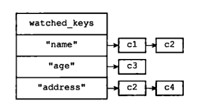

## Redis 中的事务

### 事务

Redis 通过 `MULTI`、 `EXEC`、 `WATCH`等命令来实现事务功能。事务提供了一种将多个命令请求打包，然后一次性、按顺序地执行多个命令机制，并且再事务执行期间，服务器不会中断事务而改去执行其他客户端的命令请求，它会将事务中的所有命令都执行完毕，然后采取处理其他客户端的命令请求。

事务首先以 `MULTI` 命令为开始，接着将多个命令放入事务当中，最后由 `EXEC` 命令将这个事务提交给服务器执行。

一个事务从卡死hi到结束通常会经历以下三个阶段：

1. 事务开始
2. 命令入队
3. 事务执行

当客户端处于非事务状态时，这个客户端发送的命令会立即被服务器执行。

当一个客户端切换到事务状态之后，服务器会根据这个客户端发来的不同命令执行不同的操作：

- 如果客户端发送的命令为 `EXEC`  `DISCARD`、 `WATCH`， `MULTI`四个命令的其中一个，那么服务器立即执行这个命令
- 与此相反，如果客户端发送的命令是 `EXEC`  `DISCARD`、 `WATCH`， `MULTI` 四个命令以外的命令，那么服务器并不立即执行这个命令，而是将这个命令放入一个事务队列里面，然后向客户端返回 `QUEUED` 回复

每个客户端都有自己的事务状态，这个事务状态保存在客户端状态的  `mstate` 属性里面

```c
typedef struct multiState {
	//	事务队列，FIFO顺序
    multiCmd *commands;
    
    //	已入队命令计数
    int count;
} multiState;
```

### WATCH 命令

`WATCH` 命令是一个乐观锁，它可以在 `EXEC` 命令执行之前，监视任意熟练高端数据库键，并在 `EXEC` 命令执行时，检查被监视的键是否至少有一个已经被修改过了，瑞国是的话，服务器将拒绝执行事务，并向客户端返回代表事务失败的空回复。

每个 Redis 数据库都保存着一个 `watched_keys` 字典，这个字典的键是某个被 `WATCH` 命令监视的数据库键，而字典的值则是一个链表，链表中记录了所有监视相应数据库键的客户端



**监视机制的触发**

对数据库进行修改的命令，在执行之后都会调用 `touchWatchKey` 函数对 `watched_keys` 字典进行检查，查看是否由客户端正在监视刚刚被命令修改过的数据库键，如果有的话，那么 `touchWatchKey` 函数会将监视被修改键的客户端 `REDIS_DIRTY_CAS` 标识打开，表示该客户端的事务安全性已经被破坏。

```c
def touchWatchKey(db, key){
    # 如果键 key 存在于数据库的 watched_keys 字典中
    # 那么说明至少有一个客户端在监视这个 key
    if key in db.watch_keys:
    	
    	# 遍历所有监视键 key 的客户端
	    for client in db.watch_keys[key]:
    	
    		# 打开标识
    		client.flags |= REDIS_DIRTY_CAS
    
}
```

**判断事务是否安全**

当服务器其接收到一个客户端发来的 `EXEC` 命令时，服务器会根据这个客户端是否打开了 `REDIS_DIRTY_CAS` 标识来决定是否执行事务：

- 如果客户端的 `REDIS_DIRTY_CAS` 标识已经被打开，那么说明客户端所监视的键当中，至少一个键已经被修改过了，在这种情况下，客户端提交的事务已经不再安全，所以服务器会拒绝执行客户端提交的事务。
- 如果客户端的 `REDIS_DIRTY_CAS` 标识没有被打开，那么说明客户端监视的所有键都没有被修改过（或者客户端没有监视任何键），事务仍然是安全的，服务器将执行客户端提交的事务。

### Redis 事务的 ACID 特性

在 Redis 中，事务总具有原子性（Atomicity）、一致性（Consistency）和隔离性（Isolation），并且当 Redis 运行在某种特定的持久化模式下，事务也具有持久性（Durability）。

**原子性**

事务具有原子性是指，数据库将事务中的多个操作当作一个整体来执行，服务器要么就执行事务中的所有操作，要么就一个操作也不执行。Redis是满足原子性的。

但是 Redis的事务和传统的关系型数据库事务最大的区别在于，Redis 不支持事务回滚机制（rollback），即使事务队列中的某个命令在执行期间出现了错误，整个事务也会继续执行下去，直到事务队列中的所有命令都执行完毕为止。

Redis 的作者在事务功能的文档中解释说，不支持事务回滚是因为这种复杂的功能和 Redis 追求简单高效的设计主旨不相符，并且它认为，Redis事务的执行时错误通常都是编程错误产生的，这种错误通常只会出现在开发环境中，而很少会在实际的生产环境中出现，所以他认为没有必要为Redis开发事务回滚功能。

**一致性**

事务具有一致性指的是，如果数据库在执行事务之前是一致的，那么在事务执行之后，无论事务是否执行成功，数据库也仍然是一致的。

”一致“指的是数据符合数据库本身的定义和要求，没有包含非法或者无效的错误数据。

1. 入队错误：如果一个事务在入队命令的过程中，出现了命令不存在，或者命令的格式不正确等情况，那么 Redis 将拒绝执行这个事务。
2. 执行错误：除了入队时可能发生错误以外，事务还可能在执行的过程中发生错误。
   - 执行过程中发生的错误都是一些不能再入队时被服务器发现的错误，这些错误会在命令实际执行时被触发
   - 即使在事务的执行过程中发生了错误，服务器也不会中断事务的执行，它会继续执行事务中余下的其他命令，并且已执行的命令（包括执行命令所产生的结果）不会被出错的命令影响。

3. 服务器停机
   - 如果服务器运行在无持久化的内存模式下，那么重启之后的数据库将是空白，因此数据库总是一致
   - 如果服务器运行在 RDB 模式下，那么事务中途停机不会导致不一致性，因为服务器可以根据现有的 RDB 文件来回复数据，从而将数据库还原到一个一致的状态。如果找不到可供使用的 RDB 文件，那么重启之后的数据库将是空白的，而空白数据库总是一致的。
   - 如果服务器运行在 AOF 模式下，那么事务中途停机不会导致不一致性，因为服务器可以根据现有的 AOF文件来回复数据，从而将数据库还原到一个一致的状态。如果找不到可供使用的 AOF文件，那么重启之后的数据库将是空白的，而空白数据库总是一致的。

**隔离性**

事务的隔离性指的是，即使数据库中有多个事务并发地执行，各个事务之间也不会互相影响，并在并发状态下执行的事务和串行执行的事务产生的结果完全相同。

因为 Redis 使用单线程的方式来执行事务（以及事务队列中的命令），并且服务器保证，在执行事务期间不会对事务进行中断，因此，Redis 的事务总是以串行的方式运行的，并且事务也总是具有隔离性的。

**持久性**

事务的持久性指的是，当一个事务执行完毕时，执行这个事务所得的结果已被保存到永久性存储介质（比如硬盘）里面了，即使服务器在事务执行完毕之后停机，执行事务所得的结果也不会丢失。

因为 Redis 的事务不过是简单地用队列包裹起了一组 Redis 命令，Redis 并没有为事务提供任何额外的持久化功能没所以 Redis 事务的持久性由 Redis 所使用的持久化模式决定。

- 当服务器在无持久化的内存模式下运作时，事务不具有持久性：一旦服务器停机，包括事务数据在内的所有服务器数据都将丢失
- 当服务器在 RDB 持久化模式下运作时，服务器只会在特定的保存条件被满足时，才会被执行 `BGSAVE` 命令，对数据库进行保存操作，并且异步执行的 `BGSAVE` 不能保证事务数据第一时间保存到硬盘里面，因此 RDB 持久化模式下的事务也不具有耐久性。
- 当服务器运行在 AOF 持久化模式下
  - appendfsync 选项的值为 always ，程序总会在执行命令之后调用同步函数，将命令数据真正地保存到硬盘里，这种配置下时具有持久性的
  - appendfsync 选项的值为 everysec 时，程序会每秒同步一次命令数据到硬盘。因为停机可能会恰好发生在等待同步的那一秒钟之内，这可能会造成事务数据丢失，所以这种配置下的事务不具有持久性。
  - appendfsync 选项的值为 no 时，程序会交由操作系统来决定何时将命令数据同步到硬盘。因为事务数据可能在等待同步的过程中丢失，所以这种配置下的事务不具有持久性

## 实现

### 客户端

`org.isheihei.redis.core.client.RedisNormalClient` 是客户端类，`flag` 标识当前客户端是否处在事务开启状态，`dirtyCas` 则标识当前客户端 `WATCH` 的键是否被更改过。

```java
public class RedisNormalClient implements RedisClient{
    // 事务标志 true表示开启了一个事务
    private boolean flag = false;

    private final Queue<Command> multiCmd = new LinkedList<>();

    // 事务安全性标志 false表示安全
    private boolean dirtyCas = false;

    @Override
    public void setFlag(boolean flag) {
        this.flag = flag;
    }

    @Override
    public boolean getFlag() {
        return this.flag;
    }

    @Override
    public void setDirtyCas(boolean dirtyCas) {
        this.dirtyCas = dirtyCas;
    }

    @Override
    public boolean getDirtyCas() {
        return dirtyCas;
    }

    @Override
    public void addCommand(Command command) {
        multiCmd.add(command);
    }

    @Override
    public void unWatchKeys(RedisClient redisClient) {
        for (RedisDB db : dbs) {
            db.unWatchKeys(redisClient);
        }
    }
}
```

### WATCH

`org.isheihei.redis.server.handler.CommandHandler`  中给出了命令的处理逻辑，即

- 如果客户端发送的命令为 `EXEC`  `DISCARD`、 `WATCH`， `MULTI`四个命令的其中一个，那么服务器立即执行这个命令
- 与此相反，如果客户端发送的命令是 `EXEC`  `DISCARD`、 `WATCH`， `MULTI` 四个命令以外的命令，那么服务器并不立即执行这个命令，而是将这个命令放入一个事务队列里面，然后向客户端返回 `QUEUED` 回复

```java
    protected void channelRead0(ChannelHandlerContext ctx, Command command) {
        try {
            if (command instanceof Quit) {
                ctx.close();
                return;
            }
            // 如果开启了认证功能，所有命令执行前需要检查认证是否成功
            if (ConfigUtil.getRequirePass() != null && client.getAuth() == 0 && command.type() != CommandType.auth) {
                ctx.writeAndFlush(new Errors(ErrorsConst.NO_AUTH));
                return;
            }
            if (client.getFlag()) {
                if (command instanceof Exec || command instanceof Watch || command instanceof UnWatch || command instanceof Discard) {
                    ctx.writeAndFlush(command.handle(client));
                } else if (command instanceof Multi) {
                    ctx.writeAndFlush(new Errors(ErrorsConst.MULTI_CAN_NOT_NESTED));
                } else {
                    client.addCommand(command);
                    ctx.writeAndFlush(new SimpleString("QUEUED"));
                }
            } else {
                if (command instanceof Exec) {
                    ctx.writeAndFlush(new Errors(ErrorsConst.EXEC_WITHOUT_MULTI));
                } else if (command instanceof Discard) {
                    ctx.writeAndFlush(new Errors(ErrorsConst.DISCARD_WITHOUT_MULTI));
                } else if (command instanceof Save) {
                    if (rdb != null) {
                        rdb.save();
                    }
                    ctx.writeAndFlush(command.handle(client));
                } else if (command instanceof BgSave) {
                    if (rdb != null) {
                        rdb.bgSave();
                    }
                    ctx.writeAndFlush(command.handle(client));
                } else {
                    ctx.writeAndFlush(command.handle(client));
                }
            }
        } catch (Exception e) {
            LOGGER.error("执行命令出错", e);
            ctx.writeAndFlush(new Errors(ErrorsConst.INTERNEL_ERROR));
        }
    }
```

`WATCH` 和 `UNWATCH` 命令的实现，用了一个 `watchKeys` 字典，其中字典的 key 是监视的键的 key，字典的 value 是弱引用 `WeakHashMap`。

>弱引用（WeakReference）无法阻止GC回收，如果一个对象时弱引用可到达，那么在下一个GC回收执行时，该对象就会被回收掉。
>
>**WeakHashMap如何不阻止对象回收呢**
>
>```java
>//	WeakHashMap的Entry继承了WeakReference。
>private static final class Entry<K, V> extends WeakReference<K> implements Map.Entry<K, V> {
>   int hash;
>   boolean isNull;
>   V value;
>   Entry<K, V> next;
>   interface Type<R, K, V> {
>       R get(Map.Entry<K, V> entry);
>   }
>   Entry(K key, V object, ReferenceQueue<K> queue) {
>       //	Key作为了WeakReference指向的对象
>       super(key, queue);
>       isNull = key == null;
>       hash = isNull ? 0 : key.hashCode();
>       value = object;
>   }
>```
>
>WeakHashMap 通过在get()，size() 等操作前执行，删除掉引用为null的Entry。
>
>```java
>    private void expungeStaleEntries() {
>        for (Object x; (x = queue.poll()) != null; ) {
>            synchronized (queue) {
>                @SuppressWarnings("unchecked")
>                Entry<K,V> e = (Entry<K,V>) x;
>                int i = indexFor(e.hash, table.length);
>
>                Entry<K,V> prev = table[i];
>                Entry<K,V> p = prev;
>                while (p != null) {
>                    Entry<K,V> next = p.next;
>                    if (p == e) {
>                        if (prev == e)
>                            table[i] = next;
>                        else
>                            prev.next = next;
>                        // Must not null out e.next;
>                        // stale entries may be in use by a HashIterator
>                        e.value = null; // Help GC
>                        size--;
>                        break;
>                    }
>                    prev = p;
>                    p = next;
>                }
>            }
>        }
>    }
>```
>
>

这里为什么要用弱引用呢？

当我们使用客户端连接的时候，服务器会创建一个对应的 RedisClien 对象，该连接的所有信息以及事务队列等都保存在这个客户端对象中。

想象一个场景：当我们在使用 `WATCH` 监视了一个key，但是没有调用 `EXEC` 、`UNWATCH` 或 `DISCARD` 清空监视的key，而是直接断开了客户端连接。那么这个客户端对象实际上就是一个应该被回收的对象，但是由于 `watchKeys` 中还保留了该对象的引用，所以无法对该客户端对象进行 GC 回收，造成了内存泄漏。

如果使用 `WeakHashMap` 弱引用，当客户端强行断开连接后， JVM 不会阻止只有一个弱引用对象的 GC 回收。

```java
public class RedisDBImpl implements RedisDB {
    
    // watch_keys 客户端使用弱引用对象 当客户端在事务执行中意外关闭的时候 会自动gc 防止占用内存
    private final Map<BytesWrapper, WeakHashMap<RedisClient, Boolean>> watchKeys = new HashMap<>();
    
    // 每对一个键进行修改时，需要进行判断该键是否被某些客户端监视，并修改对应客户端的事务安全性标志
    @Override
    public void touchWatchKey(BytesWrapper key) {
        WeakHashMap<RedisClient, Boolean> map = watchKeys.get(key);
        if (map != null) {
            map.forEach((redisClient, aBoolean) -> redisClient.setDirtyCas(true));
        }
    }

    @Override
    public void watchKeys(List<BytesWrapper> keys, RedisClient redisClient) {
        keys.forEach(key -> {
            if (watchKeys.containsKey(key)) {
                watchKeys.get(key).put(redisClient, true);
            } else {
                WeakHashMap<RedisClient, Boolean> clients = new WeakHashMap<>();
                clients.put(redisClient, true);
                watchKeys.put(key, clients);
            }
        });
    }


    @Override
    public void unWatchKeys(RedisClient redisClient) {
        for (Map.Entry<BytesWrapper, WeakHashMap<RedisClient, Boolean>> mapEntry : watchKeys.entrySet()) {
            mapEntry.getValue().remove(redisClient);
        }
    }
}
```

### EXEC

事务的执行与 Redis 不同的一点是，如果事务中某条命令存在语法错误，Redis 会在命令入队时就进行报错，并废弃整个事务。

而我的实现中由于命令的检查过程是在命令实际执行时，所以没有分离出两步检查，无法在入队时进行语法检查。但是实际执行的过程中，只会执行那些语法和实际执行都合法的操作。

后续也可以进行优化，改为和 Redis 一致的语法检查顺序，但是需要重构所有的命令处理类，工作量比较大，以后有机会的话会慢慢实现。

 ```java
 public class Exec extends AbstractCommand {
     @Override
     public CommandType type() {
         return CommandType.exec;
     }
 
     @Override
     public Resp handle(RedisClient redisClient) {
         // 如果watch key被改动了 则全部拒绝执行
         // 如果watch未被改动，则全部执行（执行出错或者语法错误的命令都会失败）
         ArrayList<Resp> resps = new ArrayList<>();
         if (redisClient.getDirtyCas()) {
             resps.add(BulkString.NullBulkString);
         } else {
             Command cmd;
             while ((cmd = redisClient.getCommand()) != null) {
                 Resp resp = cmd.handle(redisClient);
                 resps.add(resp);
             }
         }
         redisClient.flushCommand();
         redisClient.setDirtyCas(false);
         redisClient.getDb().unWatchKeys(redisClient);
         redisClient.setFlag(false);
         return new RespArray(resps.toArray(new Resp[0]));
     }
 }
 ```
